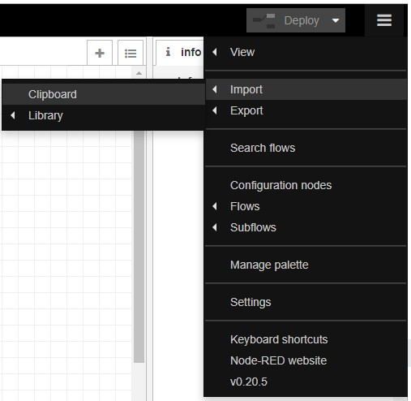
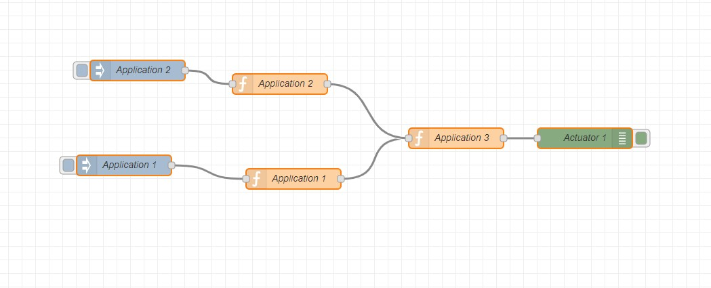
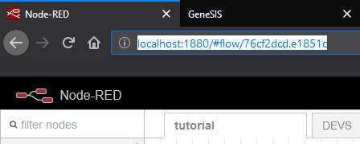
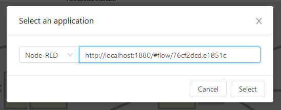
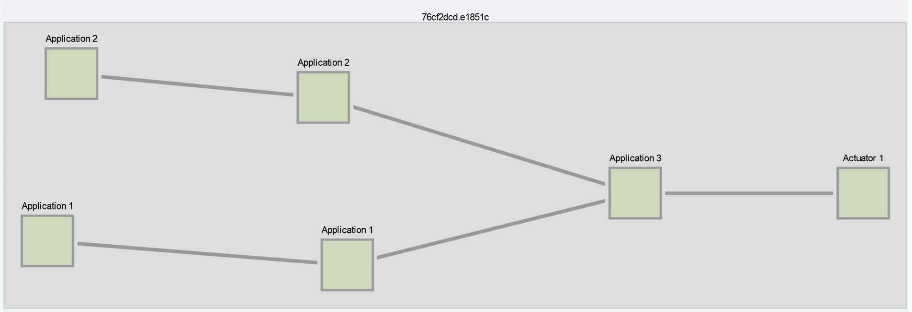
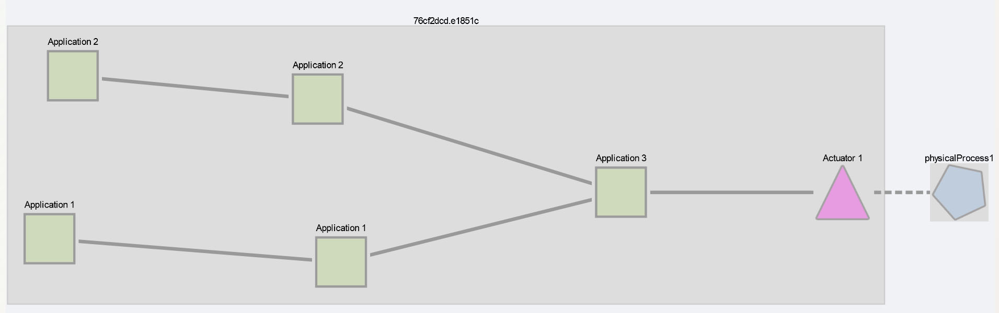
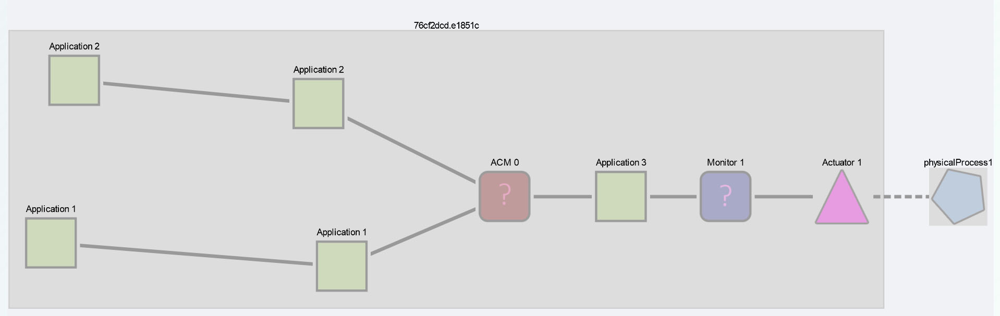
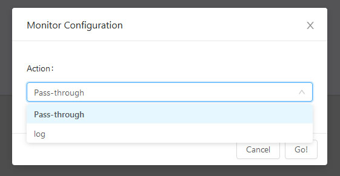
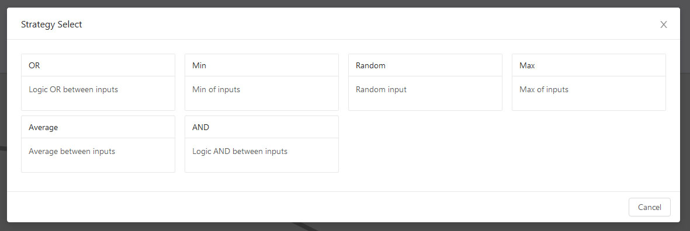
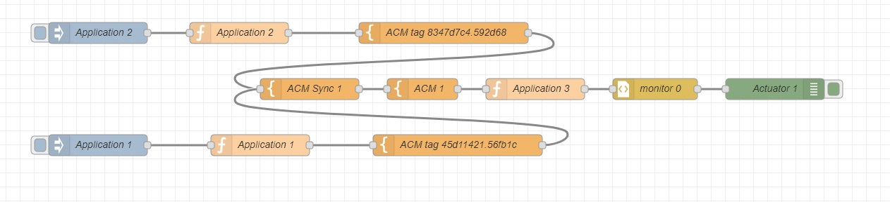

# Using ACM to solve direct conflicts in a Node-RED application

In this example we will use ACM on a local Node-RED flow to detect and solve direct conflicts. A direct conflict is one that results from the construction of the application itself.

## Prerequisites

- Node-RED
- Running ACM instance, instructions on getting ACM up can be found [here](../../../README.md)

## Load the flow in Node-RED:

- Open Node-RED in your browser: http://localhost:1880

- Open the import from clipboard menu

- Load [flow.json](./flow.json) using the dialog, press import, click to place the nodes in a flow.

This simple example flow contains a direct conflict. Application 1 and Application 2 both input values to Application 3.

## Load the flow in ACM for analysis

- Open the ACM interface in your browser: http://localhost:3333/

- Click "Load Model" in the menu at the top.

- Go back to Node-RED, select the flow tab and copy its URL

- Paste the URL in the "Select application" dialog, select Node-RED as application type, and press Select

- The flow appears in the main ACM view, looking very much like the Node-RED flow 

 
- Click on the "Actuator 1" node to bring up a dialog to attach it to a physical process

- In the drop down, select "Create new..." and press Go!

- Input a name for the physical process, and press Go!

- The physical process will appear on the main view as a blue pentagon, and it will be linked to Actuator 1. Actuator 1 turns into a pink triangle to reflect its change from simple Software Component to Action

- The next step is to click "Find conflicts" in the menu at the top. When ACM finishes processing the model, the view will be updated with several new nodes, marking actions the ACM could take.

    - a blue monitor node before the actuator
    - a red ACM node before application 3

## Adding monitors

- In the main inteface, click on the blue Monitor node
- A dialog opens with configuration information for the Monitor
   -  *Currently the monitor only logs to the node-red console, extra logging features will be available later*

- Once the configuration is completed, press Go!
- The monitor icon changes, signaling is is configured and ready to be deployed

## Configuring an actuation conflict manager

- In the main interface, click on the red ACM node
- A dialog opens with the available strategies from the palette

- Select the desired one
- The ACM's icon changes to signal it's configured and ready to be deployed

## Deploying
- Select Deploy => Deploy to target in the menu at the top
- The updated flow will be deployed in Node-RED, and visible after refreshing the Node-RED UI page
