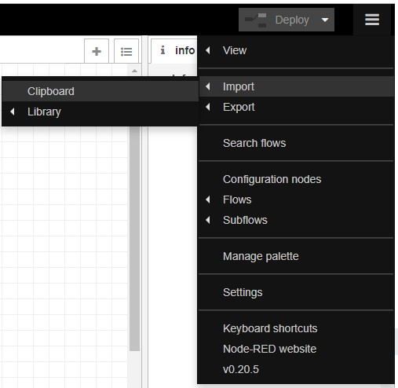
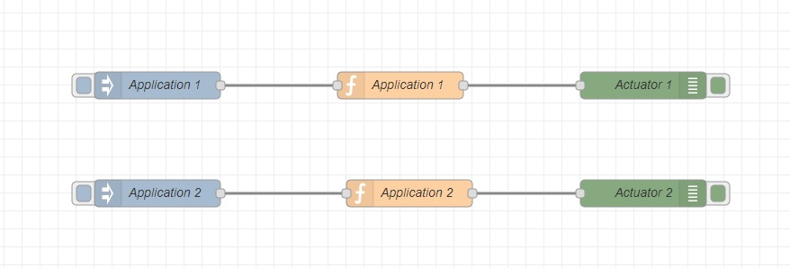
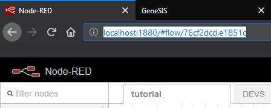
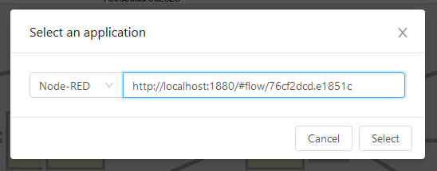
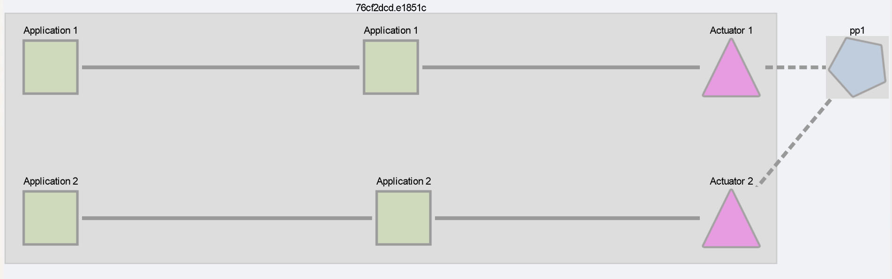
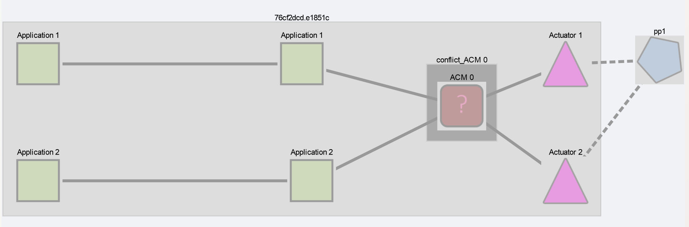
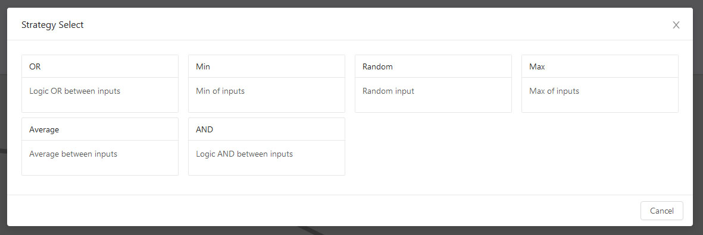
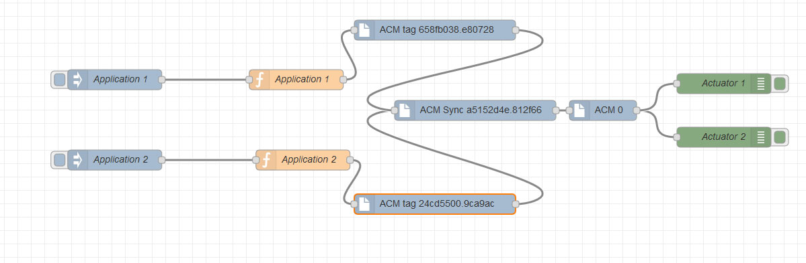

# Using ACM to solve indirect conflicts in a Node-RED application

In this example we will use ACM on a local Node-RED flow to detect and solve indirect conflicts. An indirect conflict is a conflict that doesn't exist in the static definition of the application but that can be detected through an environment model.

## Prerequisites

- Node-RED
- Running ACM instance, instructions on getting ACM up can be found [here](../../../README.md)

## Load the flow in Node-RED: 

- Open Node-RED in your browser: http://localhost:1880

- Open the import from clipboard menu

- Load [flow.json](./flow.json) using the dialog, press import, click to place the nodes in a flow.

This simple example flow contains an indirect conflict. While there are two seperate branches in the flow, Actuator 1 and Actuator 2 both impact the same physical process so there is a potential actuation conflict.

## Load the flow in ACM for analysis

- Open the ACM interface in your browser: http://localhost:3333/ 

- Click "Load model" in the menu at the top.

- Go back to Node-RED, select the flow tab and copy its URL

- Paste the URL in the "Select application" dialog, select Node-RED as application type, and press Select

- Click on the "Actuator 1" node to bring up a dialog to attach it to a physical process

- In the drop down, select "Create new..." and press Go!

- Input a name for the physical process, and press Go!
- 
- Click on the "Actuator 2" node to bring up a dialog to attach it to a physical process

- In the drop down, select the physical process crated previously and press Go!

- Click on find conflicts in the menu at the top, the detected conflict will appear in the view.

## Solving the conflict

- In the main interface, click the red ACM node
- A dialog opens with the available strategies from the palette

- Select the desired one
- The ACM's icon change to signal it is configured and ready to be deployed

## Deploying
- Press Deploy -> Deploy to target
- Flow is deployed into Node-RED straight
- Reload Node-RED UI page 
