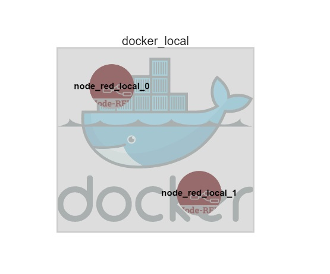
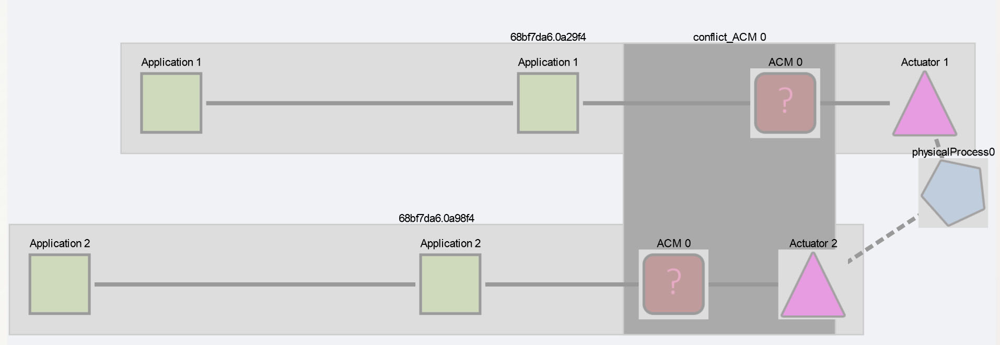

# Using ACM with a GeneSIS deployment model

In this example we will use ACM on a GeneSIS deployment model. GeneSIS deploys two Node-RED instances, each Node-RED containing one simple flow interacting with a single actuator. 

## Prerequisites

- A GeneSIS instance able to deploy Docker containers and Node-RED
  - A recommended read would be the GeneSIS tutorials, especially [Node-RED localhost](https://gitlab.com/enact/GeneSIS/tree/master/docs/tutorial/1.nodered_localhost) and [Two Node-REDs on localhost](https://gitlab.com/enact/GeneSIS/tree/master/docs/tutorial/3.two_nodered)
- Running ACM instance, instructions on getting ACM up can be found [here](../../../README.md)

## Building the GeneSIS deployment model

- Open the GeneSIS interface in your browser: http://localhost:8880/
- Add a Docker Engine (InfrastructureComponent) and configure it as such
  - name: docker_local
  - id: docker_local
  - ip: IP address of Docker Engine
  - port: ["2376"]

- Add two Node-RED components (SoftwareComponent/Internal)
  - Configure the first as such:
    - name: node_red_local_0
    - id: node_red_local_0
    - nr_flow:
      - contents of [nr_flow_0.json](./nr_flow_0.json)
        ```
        [{
		    "id": "534e8391.16269c",
		    "type": "inject",
		    "z": "68bf7da6.0a29f4",
		    "name": "Application 1",
		    "topic": "",
		    "payload": "true",
		    "payloadType": "bool",
		    "repeat": "",
		    "crontab": "",
		    "once": false,
		    "onceDelay": 0.1,
		    "x": 550,
		    "y": 220,
		    "wires": [["9b11eba.111b618"]]
	    }, {
		    "id": "9b11eba.111b618",
		    "type": "function",
		    "z": "68bf7da6.0a29f4",
		    "name": "Application 1",
		    "func": "\nreturn msg;",
		    "outputs": 1,
		    "noerr": 0,
		    "x": 820,
		    "y": 220,
		    "wires": [["68b39a65.2fa0c4"]]
	    }, {
		    "id": "68b39a65.2fa0c4",
		    "type": "debug",
		    "z": "68bf7da6.0a29f4",
		    "name": "Actuator 1",
		    "active": true,
		    "tosidebar": true,
		    "console": false,
		    "tostatus": false,
		    "complete": "payload",
		    "targetType": "msg",
		    "x": 1090,
		    "y": 220,
		    "wires": []
	    }]
        ```

  - And the second:
    - name: node_red_local_1
    - id: node_red_local_1
    - docker_resource: 
        ```
            {"name":"a resource","image":"nicolasferry/multiarch-node-red-thingml:latest","command":"","port_bindings":{"1881":"1880"},"devices":{"PathOnHost":"","PathInContainer":"","CgroupPermissions":"rwm"}}
        ```
    - nr_flow:
      - contents of [nr_flow_1.json](./nr_flow_1.json)
      ```[{
		"id": "9e1ac4.38bee54",
		"type": "inject",
		"z": "68bf7da6.0a29f4",
		"name": "Application 2",
		"topic": "",
		"payload": "true",
		"payloadType": "bool",
		"repeat": "",
		"crontab": "",
		"once": false,
		"onceDelay": 0.1,
		"x": 470,
		"y": 220,
		"wires": [["ede3df0b.aef39"]]
	    }, {
		    "id": "ede3df0b.aef39",
		    "type": "function",
		    "z": "68bf7da6.0a29f4",
		    "name": "Application 2",
		    "func": "\nreturn msg;",
		    "outputs": 1,
		    "noerr": 0,
		    "x": 750,
		    "y": 220,
		    "wires": [["845bded2.c87f5"]]
	    }, {
		    "id": "845bded2.c87f5",
		    "type": "debug",
		    "z": "68bf7da6.0a29f4",
		    "name": "Actuator 2",
		    "active": true,
		    "tosidebar": true,
		    "console": false,
		    "tostatus": false,
		    "complete": "payload",
		    "targetType": "msg",
		    "x": 1010,
		    "y": 220,
		    "wires": []
	    }]
        ```
- Add Containment links between node red instances and the docker container
- The resulting deployment model should look like this in the GeneSIS editor


- Press Deploy/All and wait for GeneSIS to finish deploying all the Node-REDs
  - A first Node-RED instance is available at http://<docker_ip>:1880
    - This instance contains Application 1 flow
  - A second Node-RED instance is available at http://<docker_ip>:1881
    - This instance contains Application 2 flow
- Finally export this deployment model using the File menu
  - *For reference, [here's the deployment model](./genesis_dm.json) that will be used for the rest of the tutorial. It should be identical to the one just created*

## Load the flow in ACM for analysis

- Open the ACM interface in your browser: http://localhost:3333/ 
- Click "Load model" in the menu at the top.
- Input the GeneSIS server URL, set model type to GeneSIS

- After loading the GeneSIS model into ACM, click on Environment model => Load environment model
- In the dialog, input the environment model data from [this file](./physical_env.json):
  - The environment model is composed of two collections, loosely resembling extra Node-RED nodes
    - ```physical_processes```: contains a list of defined physical processes
    - ```links```: contains a list of links, linking an actuator node (through its Node-RED id) to a physical process
```
    {
      "physical_processes": [
        {
          "id": "9b11eba.0a29f4",
          "name": "physicalProcess0",
          "x": 200,
          "y": 200
        }
      ],
      "links": [
        {
          "from_id": "845bded2.c87f5",
          "to_id": "9b11eba.0a29f4"
        },
        {
          "from_id": "68b39a65.2fa0c4", 
          "to_id": "9b11eba.0a29f4"
        }
      ]
    }

```
- Press Done

- Then click on Find conflicts to let ACM identify the issues

- ACM shows a view of both flows, inside boxes representing the two Node-REDs. ACMs are created and put in their own box representing the two nodes in each flow are linked.


  - Two extra ACM nodes appear in front of both actuators
    - The nodes communicate with each other and act as a single ACM
    - The reason multiple nodes are created is to support indirect actuation conflicts across several Node-RED flows

## Solving the conflict

- In the main interface, click on one the red ACM nodes
- A dialog opens with the available strategies from the palette

- Select the desired one
    - *Currently, the ECA rule engine is not implemented but the node can be configured*
- If the node has configuration, like the ECA rules node, an extra dialog appears allowing input of extra configuration data
- When the configuration, if any, is completed both linked ACM's icon change to signal they are configured and ready to be deployed

## Deploying
*Currently ACM only exports deployment models and flows and does not automatically deploy the applications*
- Press Deploy in the left side menu
- The new model will be downloaded through your browser
  - For comparison the output should be similar to [acm_model.json](./acm_model.json)
  - You can manually deploy the app in Node-RED using the same steps as to load the initial flow in Node-RED